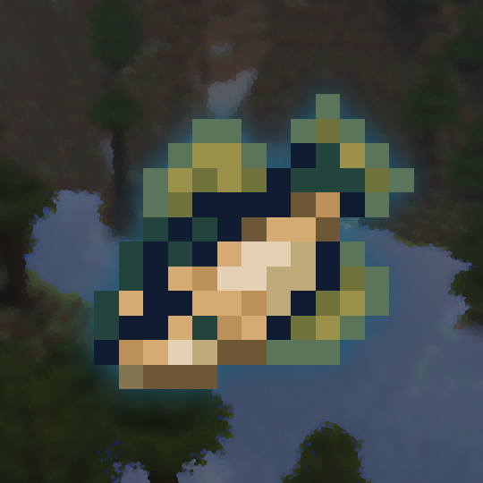

  

<h1 align="center">Matcha Fisherman's Encyclopedia</h1>

A Matcha Flavoured add-on featuring an in-game Fish Encyclopedia.

## Requirements

- Minecraft 26.2
- [Matcha Flavoured](https://modrinth.com/datapack/matcha-flavoured)

## Installation

Put the datapack in your world's datapacks folder
